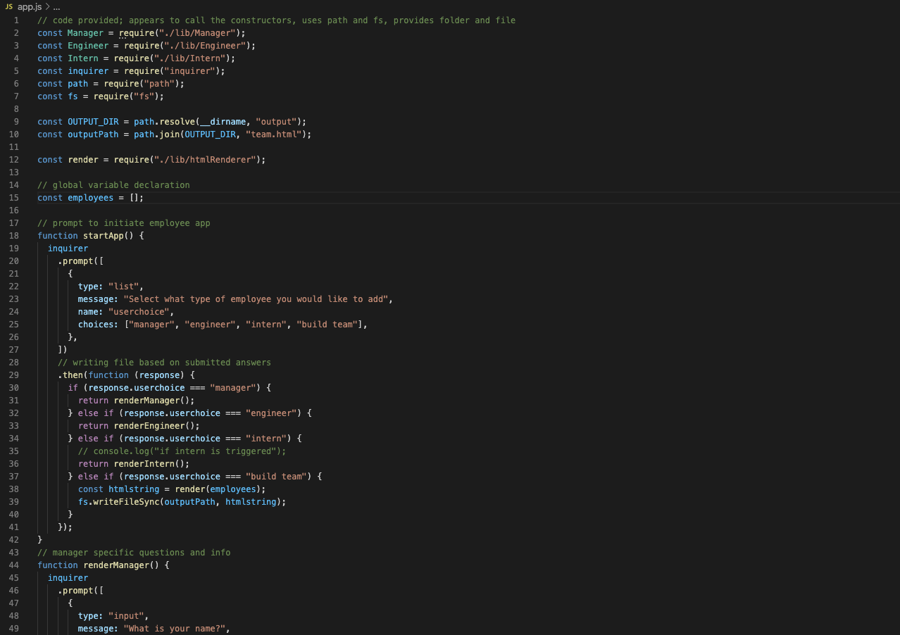
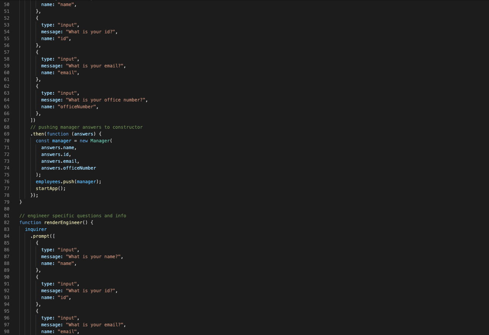
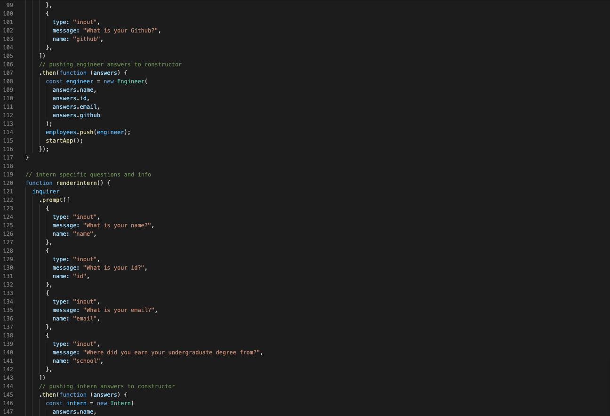
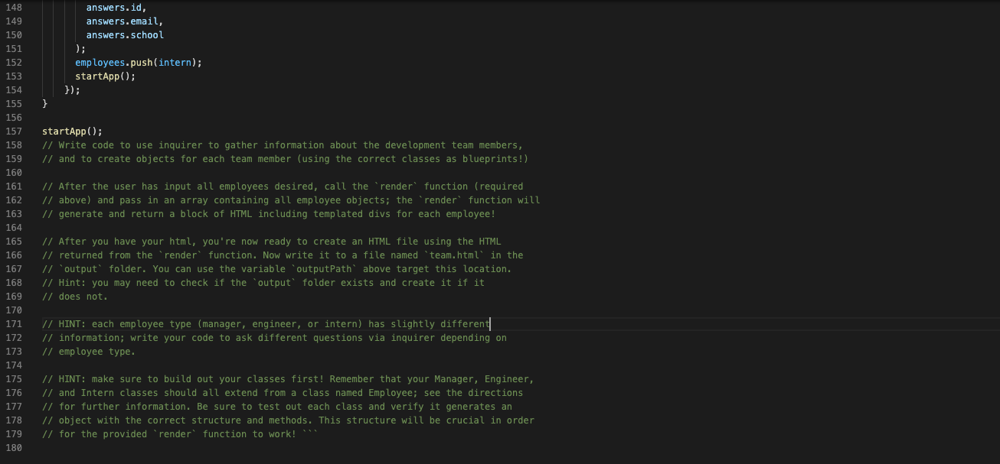
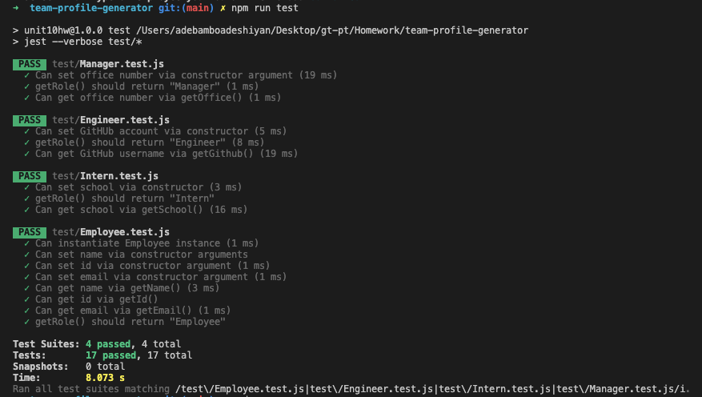

# team-profile-generator

## readme-generator

## Overview:

From the very beginning of our current bootcamp journey, it was made clear that the cornerstone of a good coding project is an effective, high-quality readme file. The readme serves as a formal introduction to the project, explaining the details of the project to the user. Typically, a readme contains sections that include, but are not limited to a title, description, screenshots and/or video sample of the deployed application, table of contents, installation, usage information, contributors and testing.

This project was created to show a developer can easily create a command-line application that dynamically generates a professional readme from the developer's input. This application was created using Node.js and javascript. Please find additional information regarding this project below. Thank you.

## Video of Application User Flow

## Screenshots of Source Code

## Screenshot of Application Test Results

## Credits

1. Node.js: https://nodejs.dev/learn/the-nodejs-fs-module

2. NPM - Inquirer: https://www.npmjs.com/package/inquirer#prompt

3. W3schools: https://www.w3schools.com/

4. MDN web docs: https://developer.mozilla.org/en-US/docs/Web/CSS

5. Youtube.com: https://www.youtube.com/watch?v=TlB_eWDSMt4

## MIT License

Copyright (c) [2020] [Adebambo Adeshiyan]

Permission is hereby granted, free of charge, to any person obtaining a copy
of this software and associated documentation files (the "Software"), to deal
in the Software without restriction, including without limitation the rights
to use, copy, modify, merge, publish, distribute, sublicense, and/or sell
copies of the Software, and to permit persons to whom the Software is
furnished to do so, subject to the following conditions:

The above copyright notice and this permission notice shall be included in all
copies or substantial portions of the Software.

THE SOFTWARE IS PROVIDED "AS IS", WITHOUT WARRANTY OF ANY KIND, EXPRESS OR
IMPLIED, INCLUDING BUT NOT LIMITED TO THE WARRANTIES OF MERCHANTABILITY,
FITNESS FOR A PARTICULAR PURPOSE AND NONINFRINGEMENT. IN NO EVENT SHALL THE
AUTHORS OR COPYRIGHT HOLDERS BE LIABLE FOR ANY CLAIM, DAMAGES OR OTHER
LIABILITY, WHETHER IN AN ACTION OF CONTRACT, TORT OR OTHERWISE, ARISING FROM,
OUT OF OR IN CONNECTION WITH THE SOFTWARE OR THE USE OR OTHER DEALINGS IN THE
SOFTWARE.
